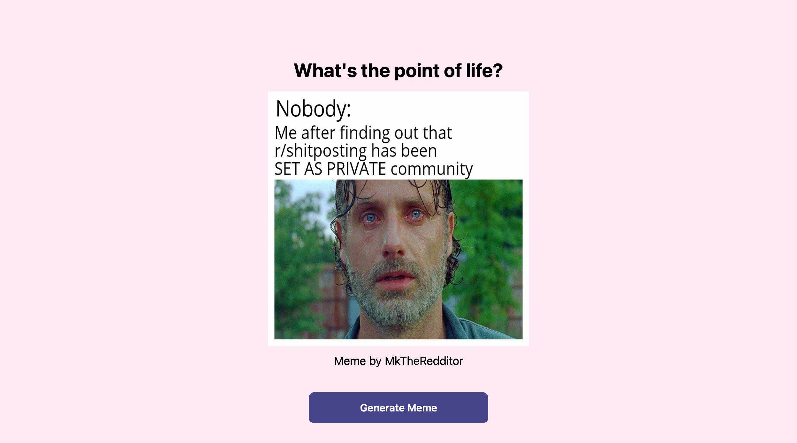

# Meme Generator App

[Live URL](https://mike-dave.github.io/meme-generator-api/)

## About The Project

This is a simple web application that generates random memes using the Meme API. It fetches data from the API and displays the meme title, image, and author on the webpage.

## Table of contents

- [Overview](#overview)
  - [How To Use](#how-to-use)
  - [Screenshot](#screenshot)
  - [Usage](#usage)
  - [Features](#features)
- [My process](#my-process)
  - [Built with](#built-with)
  - [Useful resources](#useful-resources)

## Overview

## How to Use

To use the Meme Generator App, follow these steps:

1. Open the index.html file in a web browser.
1. The app will automatically generate a meme when the page loads.
1. To generate a new meme, click the "Generate meme" button

## Screenshot

|  |  |
| -------------------------------------------- | ------------------------------------------- |

## Usage

Users should be able to:

1. Click the "Generate" button to generate a random meme.
1. Each generated meme will include the title and author's name.
1. To generate a new meme, click the "Generate" button again.

If an error occurs during the API request, an error message will be displayed, and the meme content will be hidden. In such cases, please try again later.

## Features

- Random Meme Generation: The app fetches data from the Meme API and displays a random meme each time the "Generate" button is clicked.
- Meme Information: The generated meme includes the title and author's name, which are fetched from the API.
- Error Handling: If an error occurs during the API request, an error message is displayed to alert the user.

## My process

During the development of the Meme Generator App, I followed a mobile-first workflow to ensure a responsive and user-friendly design. I used HTML, CSS, and JavaScript to create the app and implemented DOM manipulation and asynchronous JavaScript techniques to fetch data from the Meme API.

## Built With

- HTML
- Mobile-first workflow
- CSS Flexbox
- Javascript
- DOM manipulation
- Asynchronus JS
- Tailwindcss

## Useful Resources

#### - [Tailwind css](https://tailwindcss.com/) - The official tailwind css documentation.

#### - [ChatGPT](https://chat.openai.com/) - For best practices, approach, refactoring and daily life comparison and explanation
